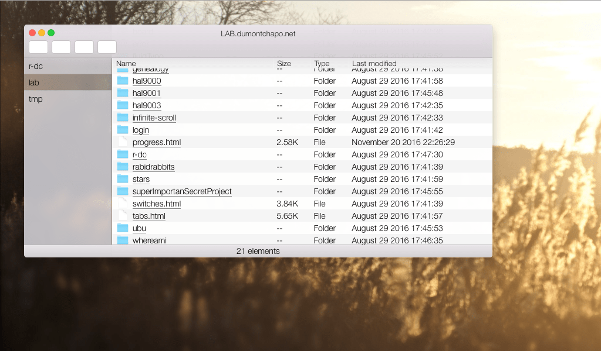

# Browsr

A web file browsr experiment from mid 2016.

I borrowed the idea from http://codepen.io/znak/pen/ntsdy
and iterated on it.

I planned to complete the buttons and to add others view options such as icon view, coverflow like, etc.
But… I haven't got the time to.

> The interface is an hommage to Apple Yosemite Finder. (© Apple & everything…)

*(Background image copyright myself)*

